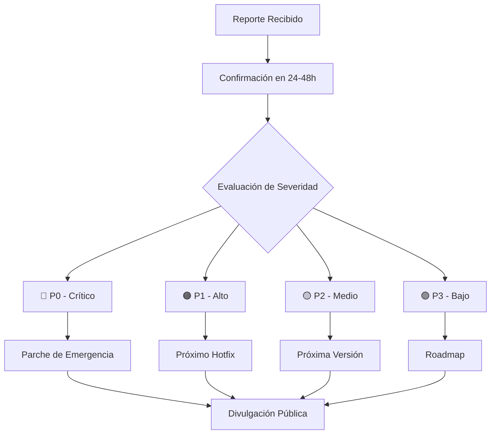

# 🔒 Política de Seguridad - The Candy Lab

## 🚨 Reportar una Vulnerabilidad


**Utiliza nuestro enlace oficial de reporte de seguridad:**

👉 **[🛡️ Reporte de Seguridad](https://github.com/thecandylab/.github/security/advisories/new)**

*Este enlace crea un advisory privado solo visible para mantenedores*

### Para vulnerabilidades CRÍTICAS (P0/P1):
👉 **[Report a security vulnerability](https://github.com/thecandylab/.github/security/advisories/new)**

*Crea un advisory privado solo para mantenedores*

### Para vulnerabilidades MEDIAS/BAJAS (P2/P3):
👉 **Usa la plantilla "🛡️ Reporte de Seguridad"** en la página de issues


### ⚠️ Por favor NO uses:
- ❌ "Open a blank issue" 
- ❌ Issues públicos
- ❌ Discusiones públicas

### ✅ Método Correcto:
- ✅ **🛡️ Reporte de Seguridad** (enlace en la página de issues)
- ✅ **Email**: security@thecandylab.com (solo como backup)


**NO reportes vulnerabilidades de seguridad a través de issues públicos o discusiones.**

### 📧 Canal Privado de Reporte
- **Email**: security@thecandylab.com
- **PGP Key**: [Disponible upon request]
- **Respuesta esperada**: 24-48 horas

### 📋 Información Requerida
Por favor, incluye en tu reporte:

```markdown
**Título**: Descripción concisa de la vulnerabilidad
**Severidad**: [Crítico/Alto/Medio/Bajo]
**Componente**: [Frontend/Backend/API/Base de datos/Infraestructura]

## Descripción
[Descripción detallada de la vulnerabilidad]

## Pasos para Reproducir
1. [Paso 1]
2. [Paso 2]
3. [Paso 3]

## Impacto Potencial
[Qué podría hacer un atacante explotando esta vulnerabilidad]

## Evidencia
[Screenshots, logs, o cualquier evidencia relevante]

## Entorno Afectado
- Versión: [ej. 1.2.3]
- Ambiente: [Producción/Staging/Development]
- Navegador/SO: [si aplica]

## Sugerencias
[Si tienes ideas para solucionarlo]
```

## 🎯 Niveles de Severidad

### 🔴 **P0 - Crítico**
- **Ejecución remota de código (RCE)**
- **Bypass completo de autenticación**
- **Exposición masiva de datos sensibles** (credenciales, PII, tokens)
- **Toma de control completa del sistema**

**Respuesta**: < 24 horas | **Resolución**: < 72 horas

### 🟠 **P1 - Alto** 
- **Escalación de privilegios**
- **Exposición limitada de datos sensibles**
- **Bypass parcial de controles de seguridad**
- **Ataques de inyección críticos**

**Respuesta**: < 48 horas | **Resolución**: < 7 días

### 🟡 **P2 - Medio**
- **Vulnerabilidades que requieren autenticación previa**
- **Exposición de información no sensible**
- **Ataques que requieren condiciones específicas**
- **Denegación de servicio de bajo impacto**

**Respuesta**: < 5 días | **Resolución**: < 14 días

### 🟢 **P3 - Bajo**
- **Problemas teóricos con impacto mínimo**
- **Requerimientos de acceso físico/privilegios administrativos**
- **Configuraciones no predeterminadas**
- **Mejoras de seguridad**

**Respuesta**: < 7 días | **Resolución**: En próximos releases

## 📊 Proceso de Manejo



## 🛡️ Versiones Soportadas

| Versión | Estado Soporte | Parches de Seguridad | Fin de Soporte |
|---------|----------------|---------------------|----------------|
| `latest` | ✅ **Activo** | ✅ Automáticos | - |
| `v1.x.x` | ✅ **Activo** | ✅ Críticos y Altos | 6 meses desde v2.0.0 |
| `v0.x.x` | ⚠️ **Limitado** | ✅ Solo Críticos | 3 meses desde v1.0.0 |
| `> 2 años` | ❌ **Sin soporte** | ❌ Ninguno | - |

## 🔄 Proceso de Divulgación

### 1. **Reporte Inicial**
- Confirmación de recepción en 24-48 horas
- Evaluación inicial de severidad

### 2. **Investigación**
- Análisis técnico detallado
- Replicación del issue
- Evaluación de impacto

### 3. **Desarrollo**
- Creación de parche
- Testing exhaustivo
- Validación de la solución

### 4. **Coordinación**
- **Con reportero**: Actualizaciones regulares
- **Internamente**: Plan de despliegue
- **Usuarios**: Notificación anticipada (para P0/P1)

### 5. **Lanzamiento**
- Despliegue del parche
- Actualización de documentación
- Comunicación pública

## 🏆 Programa de Recompensas

**The Candy Lab reconoce y recompensa a investigadores de seguridad:**

### 💰 Recompensas por Severidad
- **🔴 P0**: $500 - $1,000 USD
- **🟠 P1**: $250 - $500 USD  
- **🟡 P2**: $100 - $250 USD
- **🟢 P3**: Mención pública y swag

### ✅ Elegibilidad
- Primera reporte de la vulnerabilidad
- Seguimiento de esta política
- No afectar a otros usuarios durante la investigación
- Dar tiempo razonable para la resolución

## 📋 Checklist de Seguridad para Contribuidores

Antes de enviar un PR, verifica:

### 🔐 Autenticación y Autorización
- [ ] No hay credenciales hardcodeadas
- [ ] Los tokens tienen expiración
- [ ] Principio de menor privilegio implementado
- [ ] Validación de sesiones y permisos

### 🛡️ Protección de Datos
- [ ] Datos sensibles encriptados en tránsito (TLS) y reposo
- [ ] Sanitización de todas las entradas de usuario
- [ ] No exposición de información sensible en logs/errores
- [ ] Headers de seguridad implementados (CSP, HSTS)

### 🔍 Seguridad del Código
- [ ] Análisis estático de seguridad ejecutado
- [ ] Dependencias actualizadas y escaneadas
- [ ] No hay código vulnerable conocido (SQLi, XSS, etc.)
- [ ] Tests de seguridad incluidos

## 🛠️ Herramientas Recomendadas

### Para Desarrolladores
```yaml
dependabot: # Para actualizaciones automáticas de dependencias
snyk:       # Escaneo de vulnerabilidades en dependencias
codeql:     # Análisis estático de seguridad
trivy:      # Escaneo de imágenes Docker
```

### Para Testing
```bash
# Escaneo de dependencias
npm audit --audit-level moderate
snyk test

# Análisis estático
gosec ./...
bandit -r ./

# Escaneo de contenedores
trivy image your-image:tag
```

## 📞 Contacto y Recursos

### 🔗 Enlaces Rápidos
- **📧 Email de Seguridad**: security@thecandylab.com
- **🔑 PGP Key**: [Disponible por solicitud]
- **📚 Documentación**: [GitHub Security Docs](https://docs.github.com/es/code-security)
- **🐛 Reportar Bug No Crítico**: [Issues](https://github.com/thecandylab/.github/issues)

### 👥 Equipo de Seguridad
- **Líder de Seguridad**: [Nombre] - security-lead@thecandylab.com
- **Responsable de Infraestructura**: [Nombre] - infra@thecandylab.com
- **Desarrollo Seguro**: dev-security@thecandylab.com

## 📝 Actualizaciones de esta Política

**Última actualización**: {{08/11/2025}}
**Próxima revisión**: {{08/11/2025 + 6 meses}}
**Versión de la política**: 2.0

---

## 🙏 Agradecimientos

Agradecemos a todos los investigadores de seguridad que practican **divulgación responsable** y nos ayudan a proteger a nuestros usuarios.

**Juntos construimos software más seguro.** 🔐
